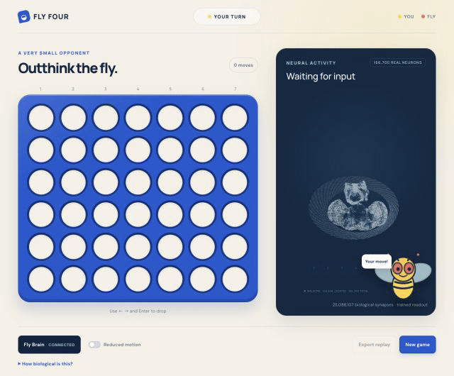

# Fly Four

Connect Four against a trained readout of the **MaleCNS fruit-fly connectome**: 166,700 neurons and 25 million biological connections.

**Codex (yellow) vs. Fly Brain (coral).** Captured from a real browser game, condensed into an animated demo. The fly blocked horizontal and vertical threats; Codex won in 17 moves after creating two winning options. Every fly move came from the running MaleCNS simulation and trained readout.

[Game replay and neural scores](docs/demo/replay.json) · [Setup, training, and scientific details](docs/guide.md)
